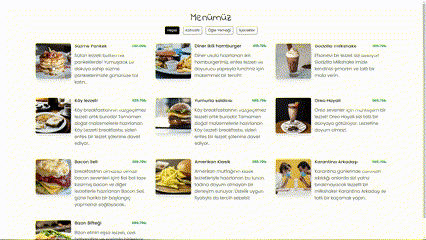

# qr-menu

**qr-menu** Project is a multi-page open-source software that can be customized for personal use.🚀  

  

---

## 🛠️ Features

- 🔹 **Feature 1**: Built with HTML5, CSS3, and JS.
- 🔹 **Feature 2**: Products are fetched from an API, using db.json as the API.
- 🔹 **Feature 3**: Responsive design.  

---

## 📚 Installation

1. Clone this project to your computer:  
   ```bash
   cd [Folder Name]
   git clone https://github.com/omerffae/qr-menu.git
```